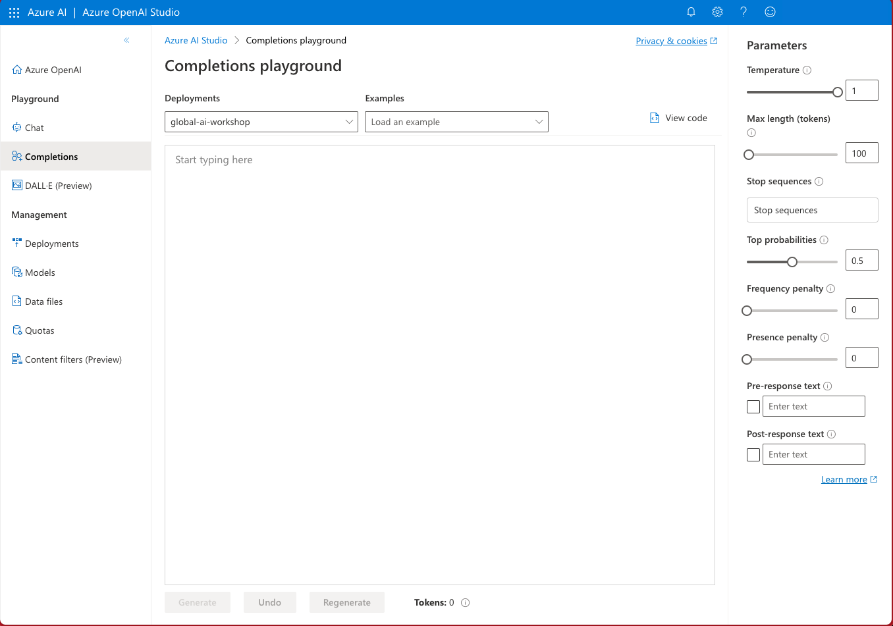

> _This is a **60-minute** workshop that will give you a hands-on introduction to the core concepts and best practices for interacting with OpenAI models._

It has been designed for _instructor-led_ sessions at Microsoft events but can also be used for _self-guided_ learning at home with additional setup as described below.

## 1. Instructor-Led Learning

:::tip REGISTRATION REQUIRED
This workshop will be run as an instructor-led session on the ongoing [Microsoft AI Tour](https://aka.ms/msaitour). The event is free **but you must be registered** to attend the workshop.
:::

In an instructor-led event, you will receive an **access key** at the start of the session that will help you unlock access to a pre-provisioned _custom playground_ for these exercises.
- [X] An Azure Subscription is activated for you.
- [X] An Azure Open AI resource is pre-provisioned.
- [X] An OpenAI `gpt-3.5-turbo` model is deployed for use.

You will then use [this custom playground](https://aka.ms/aitour/playground) application to complete the workshop exercises.

| Microsoft AI Tour: Custom Playground App |
|:---:|
|  |

If you were not able to complete the workshop in the allotted time, you can still explore the self-guided option at home, with the caveats described below.

## 2. Self-Guided Learning

:::warning ADDITIONAL SETUP REQUIRED
This workshop can be completed at home as a self-guided session. However, this will require additional setup effort and dependencies as described.
:::

For a self-guided workshop, you will need the following: 

- [ ] An Azure Subscription → [Apply here for a free account](https://aka.ms/azure/free).
- [ ] Access to Azure OpenAI → [Apply here if required](https://learn.microsoft.com/azure/ai-services/openai/overview#how-do-i-get-access-to-azure-openai).
- [ ] An Azure Open AI resource → [Create using Azure OpenAI Studio](https://learn.microsoft.com/azure/ai-services/openai/how-to/create-resource?pivots=web-portal)
- [ ] A `gpt-3.5-turbo` model deployment → [Deploy using Azure OpenAI Studio](https://learn.microsoft.com/azure/ai-services/openai/how-to/create-resource?pivots=web-portal#deploy-a-model)

You can then [navigate to the Azure OpenAI Studio](https://oai.azure.com/) to complete the exercises for a no-code experimentation experience.

|Azure OpenAI Studio: Playground App |
|:---:|
|  |

:::info OpenAI Playground APP

The OpenAI platform has its own [Playground application](https://platform.openai.com/playground) that these exercises should also work on, once you log in with a valid OpenAI account. We encourage you to explore this on your own - but for our workshop documentation, we will focus on Azure OpenAI usage.
:::