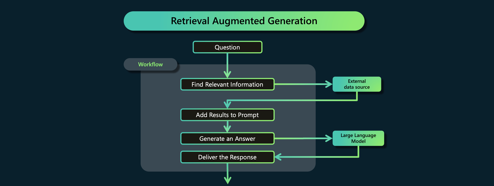

# Add knowledge

:::tip Retrieval Augmented Generation
Retrieval-Augmented Generation (RAG) is an AI technique that retrieves relevant information from a database and then uses it to help generate more informed and contextually accurate text responses.
:::

In this lab we are going to add new knowledge to the conversation. This is to illustrate how the process of adding your own data would work in a production scenario. We are going to add the data manually, but you can use many different techniques and tools to retrieve the data and add it to the conversation with the assistant.


## Adding current information:

Let's imagine that we are making a assistant for our outdoor hiking company to enable user to ask questions and get recommendations about the products the company is selling.

For a trip in the muddy mountains a customer is looking for hiking shoes.

```text title="Enter in the user prompt:"
Can you recommend me a hiking shoe for a muddy trip?
```

You will see that the model will return a lot of great suggestions, but none of them are being sold by our company.

Let's start and fix that problem by giving the model the right information on runtime and without fine-tuning.

First we start with giving the assistant a specific task.

```text title="Enter in the system prompt:"
## Task
You are an Trailwalker Hikingshoe store AI assistant. 
You help users answer questions about our shoe products.
You will be given search results as retrieved Documents that contain product information.
Your answer should be as precise as possible.
Your answer should only come from the retrieved Documents with product information.
If the Retrieved Documents do not contain sufficient information to answer user message completely, you do not answer the question and inform the user you do not have enough information.

## Retrieved Documents
No information found.
```

```text title="Enter in the user prompt:"
Can you recommend me a hiking shoe for a muddy trip?
```

Notice that the assistant will respond that it has not enough information to answer the question.

Now let's add some product information to the prompt. Imagine here that you have done a search query in a database and got the products below back.

Add this information to the system prompt.

```text title="Enter in the system prompt:"

## Retrieved Documents
No information found.

Product name: Trailwalker X1
Product description:
Harness the power of enduring comfort on your hikes with our expertly designed hiking shoes. Featuring cushioned insoles, supportive ankle collars, and breathable materials, they ensure your feet are cradled in comfort with every step on the trail. Say goodbye to blisters and fatigue, and hello to enjoyable long-distance treks

Product name: Sandwalker T7
Product description:

Crafted with versatility and durability in mind, these hiking shoes feature a lightweight design with breathable materials that provide comfort on warm, sandy beach hikes. Their specialized soles offer excellent traction on loose surfaces, while quick-drying uppers and sand-resistant closures keep feet protected and debris-free during your coastal adventures.

Product name: Mudmaster P9
Product description:
Constructed with advanced waterproof materials and an aggressive, multi-directional tread pattern, these hiking shoes provide exceptional grip and stability on slippery, muddied terrains. Their durable upper and reinforced toe cap offer protection against abrasions, while the cushioned midsole ensures comfort during the most challenging hikes. Designed with breathability in mind, they help maintain a dry and comfortable foot environment, even when the conditions are wet and demanding. Ideal for the adventurous hiker who refuses to let mud and rough trails slow them down.

Product name: Rockclimber U5
Product description:
Designed with rock enthusiasts in mind, these hiking shoes feature advanced rubber outsoles for unmatched traction on rocky terrains, reinforced toe caps for protection against abrasions, and a snug, supportive fit to ensure stability during your most challenging ascents. Ideal for scaling craggy landscapes, they offer the perfect blend of durability, comfort, and grip to keep you confidently moving upward.

```
Clear the conversation and ask the question again.

```text title="Enter in the user prompt:"
Can you recommend me a hiking shoe for a muddy trip?
```

The assistant should recommend you the Mudmaster P9 shoes.


### Retrieval-Augmented Generation
Retrieval-Augmented Generation (RAG) combines a language model with a search system to provide more accurate and detailed information. Here are the  steps needed:  
   
1. **Ask a Question**: You start by providing the RAG system with a question or prompt that you want more information about.  
   
2. **Find Relevant Information**: The RAG system searches a large database of texts, like Wikipedia, to find passages that contain useful information related to your question.  
   
3. **Choose the Best Bits**: The system picks the most relevant pieces of information it found during the search to help answer the question.  
   
4. **Generate an Answer**: Using the chosen information, the language model creates a response that includes details from the texts it found, making the answer more accurate and informative.  
   
5. **Deliver the Response**: You receive an answer that's been enhanced with specific information from the search, giving you a better, well-informed reply to your question.




:::info Want to learn more?
Join the workshop: "Build your RAG Application in Promptflow in Azure AI Studio".
[Find the Microsoft AI Tour Schedule here](https://msevents.microsoft.com/event?id=2142590774)
:::
