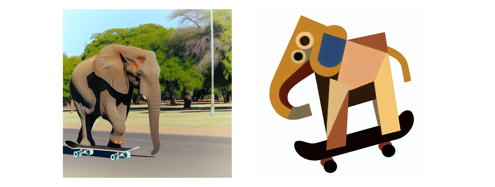

# Create Images


:::tip What is DALL-E?
DALL-E is a neural network based model that can generate graphical data from natural language input. Put more simply, you can provide DALL-E with a description and it can generate an appropriate image.
:::

The Azure OpenAI service includes the DALL-E model, which you can use to generate original images based on natural language prompts.

For example, you might submit the following natural language prompt to DALL-E:

```text title="User message"
A squirrel on a motorcycle
```

This prompt could result in the generation of graphical output such as the following image:


The images generated by DALL-E are original; they are not retrieved from a curated image catalog. In other words, DALL-E is not a search system for finding appropriate images - it is an artificial intelligence (AI) model that generates new images based on the data on which it was trained.


## Be specific 

In the Prompt box, enter a description of an image you’d like to generate. For example:

``` text title="User message"
An elephant on a skateboard
```

Then select Generate and view the image that is generated.

Modify the prompt to provide a more specific description. For example:

```text
 An elephant on a skateboard in the style of Picasso
```

Then generate the new image and review the results.




## Best practices
To create effective and accurate images with DALL-E, here are some best practices to follow:  
   
1. **Clear and descriptive prompts**: Craft your text prompts to be clear and detailed. The more specific you are with your description, the more likely DALL-E will generate an image that matches your request. Include attributes such as the subject, action, environment, style, and any important details.  
   
2. **Use of adjectives**: Employ adjectives and adverbs to describe the qualities, emotions, and characteristics you want the image to convey. This helps in refining the generated image to better match your vision.  
   
3. **Balance detail with simplicity**: While details are important, overly complicated or contradictory prompts can confuse the AI, leading to unexpected results. Aim for a balance where your description provides enough context without being overly convoluted.  
   
4. **Experiment with different styles**: Specify artistic styles or influences if you want your image to have a particular aesthetic. For example, you could ask for an image in the style of Van Gogh or a futuristic concept art.  
   
5. **Iterative approach**: Often, the first image generated may not be perfect. Use it as a starting point and iteratively refine your prompt based on the output to get closer to your desired result.  
   
6. **Aspect ratio and composition**: If you have a preference for the image’s composition or aspect ratio, include it in your prompt. For example, you might request a landscape-oriented image or a portrait with a subject off-center.  
   
7. **Cultural and contextual references**: If appropriate, include cultural or historical references to provide additional context that can help guide the image generation process.  
   
8. **Ethical considerations**: Be mindful of the ethical implications of your prompts. Avoid creating images that are offensive, perpetuate stereotypes, or infringe on copyrights.  
   
9. **Testing and learning**: Experiment with different prompts to understand how DALL-E interprets various descriptions. This learning process can help you improve the precision of your prompts over time.  
   
10. **Following guidelines**: Adhere to OpenAI's use-case policy and content guidelines when creating prompts. Avoid requesting images that are not allowed as per OpenAI's content policy.  
   
Remember that AI image generation is still an evolving technology, and sometimes it may require a bit of trial and error to get the desired outcome. By following these best practices, you can improve your chances of creating high-quality images with DALL-E.


:::tip[Assignment]
Have fun creating images, try and create images in different styles.   
**Note that the Dall-E API revises your prompt**
:::

## Some fun things to try out

- Create a new cartoon character
- Design some cool furniture
- Imagine a brand new car or other vehicle
- Create a completely new planet
- Try to make it write your letter
- Try creating a vintage style card of a famous landmark.
