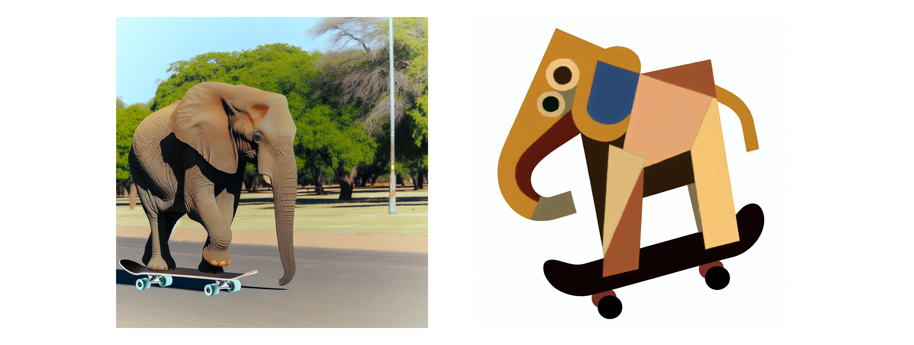

# 이미지 만들기

:::note 일러두기
이 페이지는 기계 번역을 통해 한국어로 번역했습니다. 어색한 표현이 있을 수 있으니 양해 바랍니다.
:::

:::tip DALL-E란 무엇인가요?
DALL-E는 자연어 입력으로부터 그래픽 데이터를 생성할 수 있는 신경망 기반 모델입니다. 간단히 말해, DALL-E에 설명을 입력하면 적절한 이미지를 생성할 수 있습니다.
:::

Azure OpenAI 서비스에는 자연어 프롬프트에 따라 원본 이미지를 생성하는 데 사용할 수 있는 DALL-E 모델이 포함되어 있습니다.

예를 들어 다음과 같은 자연어 프롬프트를 DALL-E에 제출할 수 있습니다:

```text title="사용자 메시지"
오토바이를 탄 다람쥐
```

이 프롬프트는 다음 이미지와 같은 그래픽 출력을 생성할 수 있습니다:


DALL-E에서 생성된 이미지는 원본이며, 큐레이션된 이미지 카탈로그에서 검색되지 않습니다. 즉, DALL-E는 적절한 이미지를 찾는 검색 시스템이 아니라 학습된 데이터를 기반으로 새로운 이미지를 생성하는 인공 지능(AI) 모델입니다.

## 구체적으로 입력하기 

프롬프트 상자에 생성하려는 이미지에 대한 설명을 입력합니다. 예를 들어

```text title="사용자 메시지"
스케이트보드를 탄 코끼리
```

그런 다음 생성을 선택하고 생성된 이미지를 확인합니다.

프롬프트를 수정하여 보다 구체적인 설명을 입력합니다. 예를 들어

```text
 피카소 스타일의 스케이트보드를 탄 코끼리
```

그런 다음 새 이미지를 생성하고 결과를 검토합니다.



## 모범 사례

DALL-E로 효과적이고 정확한 이미지를 만들기 위해 따라야 할 몇 가지 모범 사례는 다음과 같습니다:  

1. **명확하고 설명적인 프롬프트**: 텍스트 프롬프트를 명확하고 상세하게 작성하세요. 설명이 구체적일수록 DALL-E에서 요청과 일치하는 이미지를 생성할 가능성이 높아집니다. 주제, 행동, 환경, 스타일 및 중요한 세부 사항과 같은 속성을 포함하세요.  

2. **형용사  사용**: 형용사와 부사를 사용하여 이미지가 전달하고자 하는 자질, 감정, 특성을 설명하세요. 이렇게 하면 생성된 이미지가 내 비전에 더 잘 부합하도록 다듬는 데 도움이 됩니다.  

3. **디테일과 단순함의 균형을 맞추세요**: 디테일은 중요하지만 지나치게 복잡하거나 모순되는 프롬프트는 AI를 혼란스럽게 하여 예상치 못한 결과를 초래할 수 있습니다. 설명이 지나치게 복잡하지 않으면서도 충분한 맥락을 제공하는 균형을 목표로 하세요.  

4. **다양한 스타일로 실험하기**: 이미지에 특정 미학을 적용하려면 예술적 스타일이나 영향을 지정하세요. 예를 들어 반 고흐 스타일의 이미지나 미래지향적인 컨셉 아트를 요청할 수 있습니다.  

5. **반복적  접근 방식**: 처음 생성된 이미지가 완벽하지 않은 경우가 종종 있습니다. 이를 출발점으로 삼아 결과물을 바탕으로 반복적으로 프롬프트를 수정하여 원하는 결과에 가까워질 수 있습니다.  

6. **종횡비 및 구도**: 이미지의 구도나 화면 비율에 대한 선호 사항이 있는 경우 프롬프트에 이를 포함하세요. 예를 들어, 가로 위주의 이미지 또는 피사체가 중앙에서 벗어난 인물 사진을 요청할 수 있습니다.  

7. **문화적 및 맥락적 참조**: 적절한 경우 문화적 또는 역사적 참고 자료를 포함하여 이미지 생성 과정에 도움이 될 수 있는 추가 컨텍스트를 제공합니다.  

8. **윤리적  고려 사항**: 메시지의 윤리적 함의를 염두에 두세요. 불쾌감을 주거나 고정관념을 고착화하거나 저작권을 침해하는 이미지는 만들지 마세요.  

9. **테스트 및 학습**: 다양한 프롬프트를 실험하여 DALL-E가 다양한 설명을 어떻게 해석하는지 이해합니다. 이 학습 과정을 통해 시간이 지남에 따라 프롬프트의 정확성을 향상시킬 수 있습니다.  

10. **지침 준수**: 프롬프트를 만들 때 OpenAI의 사용 사례 정책 및 콘텐츠 가이드라인을 준수하세요. OpenAI의 콘텐츠 정책에 따라 허용되지 않는 이미지를 요청하지 마세요.  

AI 이미지 생성은 여전히 발전 중인 기술이며, 원하는 결과를 얻기까지 약간의 시행착오가 필요할 수 있다는 점을 기억하세요. 이러한 모범 사례를 따르면 DALL-E로 고품질 이미지를 생성할 수 있는 가능성을 높일 수 있습니다.

:::tip 숙제
이미지를 재미있게 만들고 다양한 스타일로 이미지를 만들어 보세요.   
**Dall-E API가 프롬프트를 수정한다는 점에 유의하세요**.
:::

## 몇 가지 재미있는 시도

- 새로운 만화 캐릭터 만들기
- 멋진 가구 디자인하기
- 새로운 자동차 또는 다른 차량 상상하기
- 완전히 새로운 행성 만들기
- 편지를 쓰도록 만들어 보세요.
- 유명한 랜드마크의 빈티지 스타일 카드를 만들어 보세요.
