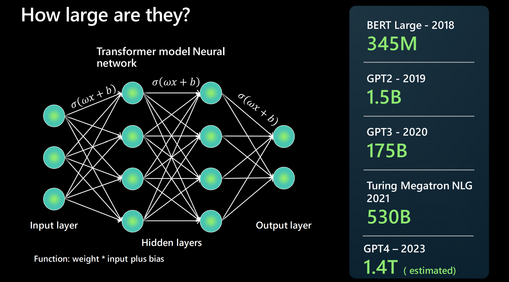

:::note 일러두기
이 페이지는 기계 번역을 통해 한국어로 번역했습니다. 어색한 표현이 있을 수 있으니 양해 바랍니다.
:::

대규모 언어 모델(LLM)은 자연어 텍스트를 처리하고 생성할 수 있는 AI의 한 유형입니다. 책, 기사, 웹 페이지 등 방대한 양의 텍스트 데이터에서 학습하여 언어의 패턴과 규칙을 발견합니다. 

### LLM은 얼마나 큰가요?

LLM은 **신경망 아키텍처**를 사용하여 구축됩니다. 입력을 받고, 언어의 여러 측면을 세분화하는 여러 개의 숨겨진 레이어와 출력 레이어가 있습니다. 사람들은 종종 다음 기본 모델이 이전 모델보다 더 크다고 보고하는데, 이것이 무엇을 의미할까요? 모델에 매개변수가 많을수록 처리하고, 학습하고, 생성할 수 있는 데이터가 많아집니다. 

신경망 아키텍처의 두 뉴런 사이의 각 연결에는 함수가 있습니다. 함수식: _가중치 * 입력 + 바이어스_. 이 함수는 모델이 언어를 처리하는 방식을 결정하는 수치 값을 생성합니다. 2018년에는 수백만 개의 매개변수에서 2023년에 계산된 수조 개의 매개변수(GPT4 기준)를 보고하는 등 그 규모가 상당히 큽니다.

### "파운데이션 모델"이란 무엇인가요?

파운데이션 모델은 대규모 텍스트 또는 코드 말뭉치(코덱스 모델의 경우)에 대해 학습되고 미세 조정된 GPT-3, GPT-4 또는 Codex와 같은 LLM의 특정 인스턴스 또는 버전을 말합니다. 이 모델은 다양한 형식의 학습 데이터를 받아들이고 **트랜스포머 아키텍처**를 사용하여 일반 모델을 구축합니다. 거기에서 프롬프트나 파인튜닝을 통해 특정 작업을 수행하기 위한 적응 및 전문화를 생성할 수 있습니다.

### LLM은 NLP와 어떻게 다른가요?

대규모 언어 모델은 기존 자연어 처리(NLP) 솔루션과 어떻게 다른가요? 아래 표는 비교를 위한 몇 가지 척도를 제공합니다.

| 기존 NLP | 대규모 언어 모델 |
| --- | --- |
| 기능당 하나의 모델이 필요합니다.  | 여러 NLP 사용 사례에 단일 모델 재사용	|
| 한정된 레이블 데이터 세트에서 학습된 모델 | 수 TB에 달하는 레이블이 없는 데이터에서 학습된 기초 모델 |
| 특정 사용 사례에 고도로 최적화됨 | 개방형 사용 - 자연어를 사용하여 모델에 무언가를 '프롬프트'하도록 함 |

### LLM이 하지 못하는 것은 무엇인가요?

대규모 언어 모델은 풍부하고 강력한 제너레이티브 AI 경험을 제공하지만, LLM은 다음과 같은 기능을 수행하지 못한다는 점을 기억해야 합니다:

- **언어를 이해하지 못합니다**: 예측 엔진일 뿐입니다. 이전에 본 텍스트 패턴을 기반으로 주어진 텍스트 입력에 대해 완성을 _예측_할 수 있습니다. 해당 콘텐츠의 문맥이나 의미를 이해하지 못합니다(예: 수학을 이해하지 못함).
- **사실을 이해하지 못합니다**: _정보 검색_과 _창의적 글쓰기_를 위한 별도의 '모드'는 없습니다. 이 모델은 진행 중인 시퀀스에서 다음으로 가능성이 높은 토큰을 예측할 뿐입니다.
- **매너, 감정 또는 윤리를 이해하지 못합니다** 인간의 특성을 부여하거나 무언가를 '이해한다'고 주장함으로써 LLM을 _의인화_하지 않습니다. 출력은 단순히 주어진 프롬프트에 따라 학습 데이터를 학습한 결과일 뿐입니다.
