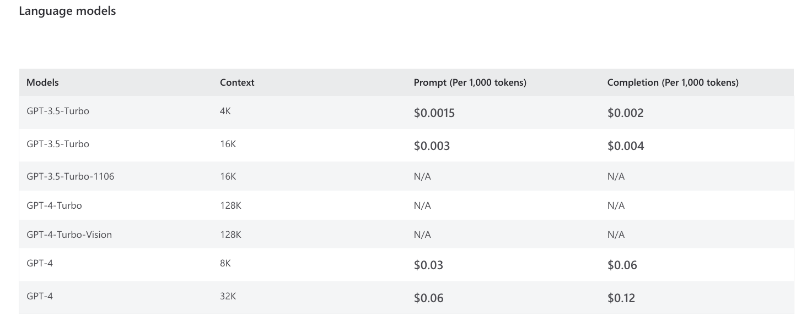

:::note 일러두기
이 페이지는 기계 번역을 통해 한국어로 번역했습니다. 어색한 표현이 있을 수 있으니 양해 바랍니다.
:::

이전 강의에서 "토큰"에 대해 몇 번 언급했지만 토큰이 무엇이고 왜 중요한지에 대해서는 설명하지 않았습니다. 이제 이에 대해 설명해 보겠습니다.

## 토큰화란 무엇인가요?

OpenAI 자연어 모델은 단어나 문자를 텍스트 단위로 사용하지 않고 그 중간의 **토큰**을 사용합니다 [정의](https://platform.openai.com/docs/introduction/tokens)에 따르면 토큰은 대규모 언어 학습 데이터 세트에서 _일반적으로 발생하는 문자 시퀀스_를 나타내는 텍스트 "청크"입니다.

- 토큰은 단일 문자, 단어의 일부 또는 전체 단어일 수 있습니다. 
- 많은 공통 단어는 하나의 토큰으로 표현됩니다.
- 덜 일반적인 단어는 여러 개의 토큰으로 표현됩니다.

이제 **토큰화**는 텍스트 데이터(예: "프롬프트")가 일련의 토큰으로 _해체_되는 과정입니다. 그런 다음 모델은 텍스트 '완성'을 위해 다음 토큰을 순서대로 생성할 수 있습니다. 이 단원의 뒷부분에서 토큰화의 구체적인 예를 살펴보겠습니다.

## 토큰은 어떻게 사용되나요?

입력 프롬프트가 주어지면 자연어 모델은 한 번에 하나의 토큰씩 완성을 생성합니다. 그러나 생성된 토큰은 결정론적이지 않습니다. 각 단계에서 모델은 연관된 가중치와 함께 가능한 모든 토큰의 목록을 출력합니다. API는 이 목록에서 하나의 토큰을 샘플링하며, 가중치가 높은 토큰이 다른 토큰보다 선택될 가능성이 높습니다.


그런 다음 해당 토큰을 프롬프트에 추가하고 완료를 위한 "최대 토큰 수" 제한(컨텍스트 창)이 충족될 때까지 또는 모델이 특별한 "토큰 중지"를 생성하여 추가 토큰 생성을 중지할 때까지 이 프로세스를 반복합니다. (Beatriz Stollnitz는 이 [블로그 게시물](https://bea.stollnitz.com/blog/how-gpt-works/)을 통해 이 프로세스에 대한 자세한 설명을 하고 있습니다.)

이것이 바로 모델이 하나 이상의 단어의 완성을 생성하는 방식이며, 이러한 완성이 호출에서 호출로 변경될 수 있는 이유입니다.

## 토큰화가 중요한 이유는 무엇인가요?

토큰화가 중요한 이유를 이해하려면 배포된 모델의 두 가지 측면을 고려해야 합니다: 토큰 한도와 토큰 가격 책정.

**토큰 한도**. 모든 모델에는 단일 요청에 대해 처리할 수 있는 최대 토큰 수로 정의된 컨텍스트 창이 있습니다. 예를 들어, 구형 gpt-3.5 turbo 모델은 각 요청에 대해 4K 토큰 제한(컨텍스트)이 있습니다. 토큰 제한은 프롬프트와 완료 간에 _공유_됩니다. 다음 토큰을 생성하기 위해 프롬프트에 완료가 추가되기 때문에 단일 요청에 대한 전체 컨텍스트 창에 두 가지를 모두 맞춰야 합니다.

**토큰 가격**. 다른 API와 마찬가지로, 모델 배포 사용에는 모델 유형과 버전에 따라 비용이 발생합니다. 현재 모델 가격은 사용된 토큰 수에 연동되어 있으며, 각 모델 유형 또는 버전마다 다른 가격대가 적용될 수 있습니다.

아래 표는 Azure OpenAI 모델의 컨텍스트 창(최대 토큰) 및 모델 가격(1K 단위로 청구됨)을 보여줍니다. 




gpt-4-32k와 같은 최신 모델은 토큰 한도가 최대 32,768개로 훨씬 더 크다는 점에 유의하세요. 이렇게 하면 더 오래 완료할 수 있을 뿐만 아니라 훨씬 더 큰 프롬프트도 가능합니다. 이는 나중에 살펴보겠지만 프롬프트 엔지니어링에 특히 유용합니다. 

사용 비용은 그에 따라 높아진다는 점을 명심하세요. 프롬프트 엔지니어링 기술은 응답 품질을 저하시키지 않으면서 토큰 사용 비용을 최소화하는 프롬프트를 제작하여 비용 효율성을 개선하는 데에도 도움이 될 수 있습니다.

## OpenAI 토큰화 도구

실제 텍스트에서 토큰화가 어떻게 작동하는지 더 자세히 알고 싶으신가요? 토큰화를 시각화하고 주어진 텍스트 데이터의 총 토큰 수를 표시하는 무료 온라인 도구인 [**OpenAI Tokenizer**](https://platform.openai.com/tokenizer)를 사용해 보세요.

[🔖 자세히 알아보기:](https://help.openai.com/articles/4936856-what-are-tokens-and-how-to-count-them)

### 예제 보기

사이트를 방문하여 '예제 보기'를 클릭하면 아래와 같이 실제로 작동하는 모습을 확인할 수 있습니다. 색상으로 구분된 각 세그먼트는 하나의 토큰을 나타내며, 총 토큰 수는 아래에 표시됩니다(**57 토큰**). 

"1234567890"와 "underlying"의 문자열 길이는 같지만 전자는 토큰이 4개이고 후자는 1개로 계산된다는 점에 유의하세요. 또한 구두점(":",".")이 각각 1토큰을 차지하여 프롬프트 토큰 한도를 줄이는 방식도 관찰하세요.


### 연습하기

:::tip 당신 차례입니다
[**https://platform.openai.com/tokenizer**](https://platform.openai.com/tokenizer)를 방문하세요. 각 연습을 시작하기 전에 도구를 지우세요. 토큰화 도구에 연습 텍스트를 입력하고 출력을 관찰하세요 - 대화형으로 업데이트되어야 합니다.
:::

**연습 1:** 일반적인 단어인 "apple"는 하나의 토큰만 필요합니다.

```
apple
```

**연습 2:** "blueberries"라는 단어에는 두 개의 토큰이 필요합니다: "blue"과 "berries".

```
blueberries
```

**연습 3:** 고유명사에는 일반적으로 여러 개의 토큰이 필요합니다(일반적이지 않은 경우). 

```
Skarsgård
```

**연습 4:** 위의 예제를 "사과", "블루베리", "스카스가르드" 등의 한글로 다시 시도한 후 토큰 수를 비교해 보세요.

이 토큰 표현을 통해 AI 모델은 사전에도 없는 단어를 생성할 수 있지만, 글자 단위로 텍스트를 생성할 필요 없이 (횡설수설하기 쉬운) 단어를 생성할 수 있습니다. 

**다른 단어나 구문을 사용해 직관력을 키우세요.**
